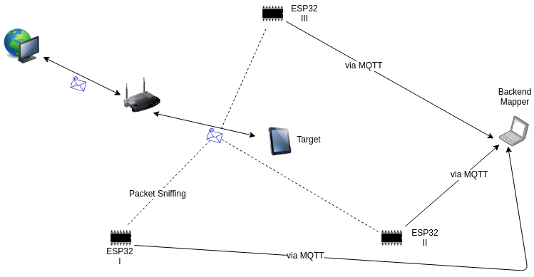
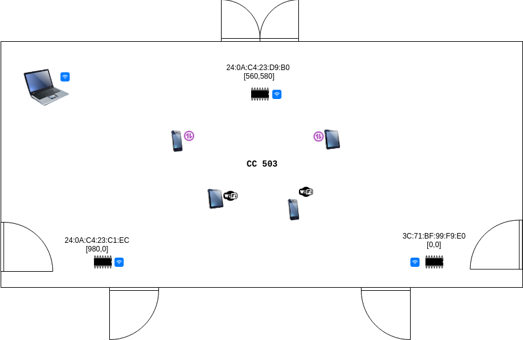
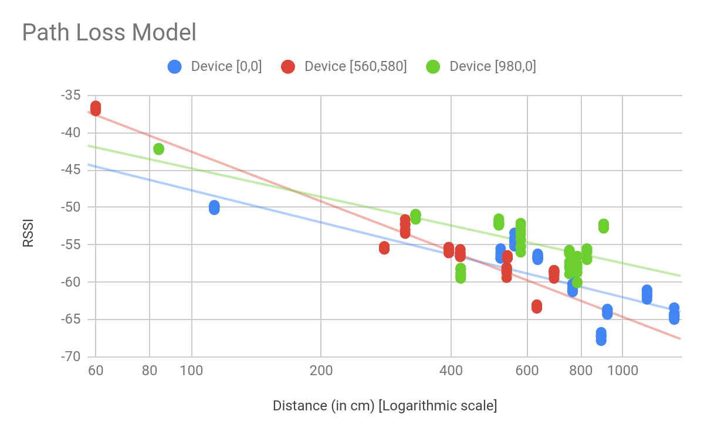
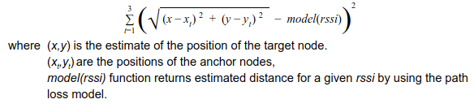
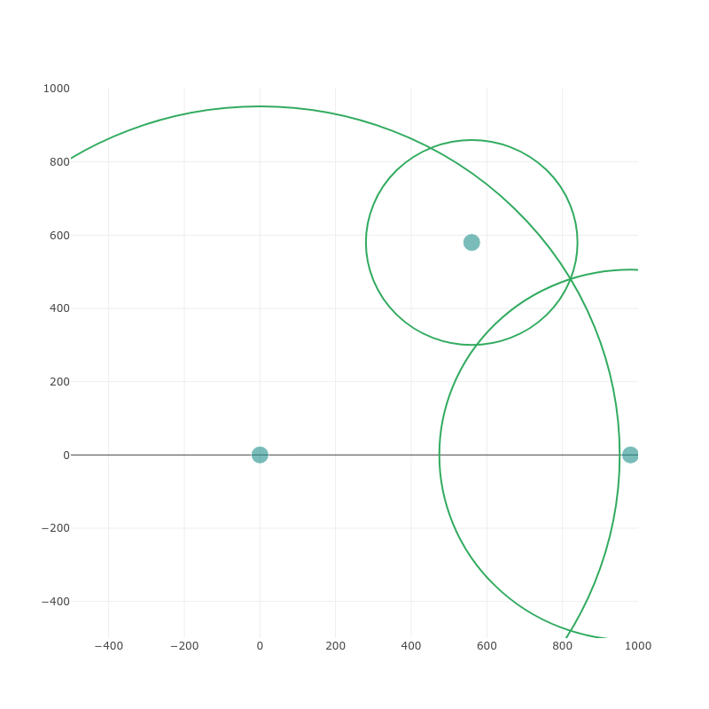
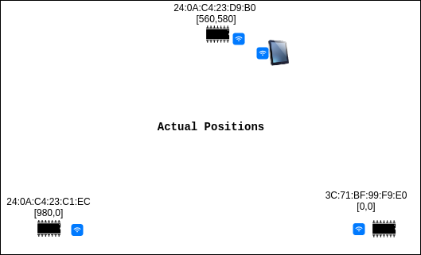
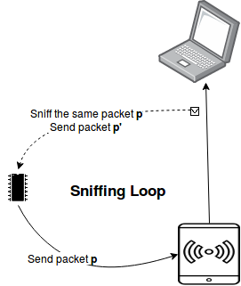

# RSSI-based Indoor Localization using ESP32

## Problem Statement:
Modern GPS systems have an error margin of 3 metres, but these fail miserably while localizing devices indoors. Usually indoor localization is done by exploiting the Wifi routers indoors. We use an Indoor path loss model along with trilateration to localize Wireless devices indoors with the help of [ESP32](https://www.espressif.com/en/products/hardware/esp32/overview) devices.

## System Architecture:

We will refer to the ESP32 devices as the anchor nodes and the mobile device as the target node. For localizing, we use the following methodology:
1. The anchor nodes operate in promiscuous mode and sniff packets from wireless devices
2. The RSSI value of each packet is communicated to the host laptop via MQTT protocol
3. The host laptop consults the Path Loss model and estimates the distance of the target node from the anchor nodes.

The anchor nodes publish the RSSI values to the topic **`/rssi/<MAC ID>`** and the host laptop subscribe to the topic **`/rssi/#`**. We use [Mosquitto](https://mosquitto.org/) as the MQTT broker on the host laptop.

## Setup:
3 ESP32 devices. 1 host laptop. 1 mobile device. The anchor nodes and the host laptop should belong to a common local network. We conducted our experiments in CC 503, new CSE building, IIT Bombay. 

## Path Loss model:
We had to build the path loss model initially to estimate the Path Loss exponent. We fixed our Anchor nodes and moved the Target node at known locations. At each location we took time averages of RSSI values for a window of 15 seconds. 

We observed *Shadowing* effects and fitted RSSI against log distance to build the path loss model. The path loss equation is as follows:

<b>RSSI = -2.031862 - 3.9955 log(d)</b>

## Localization Algorithm:
There are two threads running on the host laptop.
1. MQTT subscriber: Collects RSSI data stream from target nodes and dumps it into a shared Queue **q**.
2. Localizer: Takes the average of the RSSI data from Queue **q** for a fixed time window of 15 seconds. Localizes target nodes by minimizing 

## Results:
  

We are able to achieve an accuracy of ~ 2m using our Localization method.

## Key Insights:

### Single channel scan 

We noticed that ESP32 devices only sniff packets which are transmitted on the channel via which it is connected to the Router. So let’s say if ESP32 is associated to a specific router on channel 8, then it will sniff all the nearby packets which are transmitted on channel 8. This was a problem in collecting packets for building the path loss model as we had to transmit packets on the same channel via which ESP32 is connected to the Router. To circumvent this, we connected the ESP32 device and Target node to the same mobile hotspot and generated traffic on the Target node (Since the channel to be associated on is decided by the AP).

This restriction on the sniffing method was an impediment for us to explore CSI techniques for localization. We were not able to figure out how to use promiscuous mode for sniffing packets on all channels.

### Sniffing loop

We figured out that ESP32 devices get stuck in a sniffing loop. In our setup, the Target nodes and the host laptop were connected to the same mobile hotspot. The sniffing loop happens due to the following events
1. The anchor node sniffs a single packet on channel **c** and communicates RSSI to the host via MQTT packet **p**. First hop to the mobile hotspot.
2. Mobile hotspot forwards packet **p** to the host on channel **c**.
3. The anchor node sniffs packet **p** on channel **c** and communicates RSSI to the host via MQTT packet **p’**. First hop to the mobile hotspot.
4. Go to 2.

Because of this sniffing loop, large number of MQTT messages were published by the target nodes and it led to MQTT event handler errors. Hence we filtered out the MAC addresses of the host laptop and the mobile hotspot while sniffing.

### Association loop 

As we were encountering the sniffing loop problem described above, the ESP32 device used to restart after every MQTT event handler error. We noticed that sometimes the device gets stuck in an association loop with the AP, where it authenticates, but does not associate to send data. We were not able to resolve the problem completely. One hack we used to circumvent this: Restart the Mobile hotspot which served as the AP. 

## Team Members:
[Aniket Shirke](https://github.com/ani8897)

[Bharat Khandelwal](https://github.com/khandelwalbharat)

